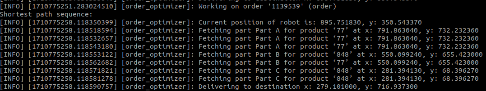
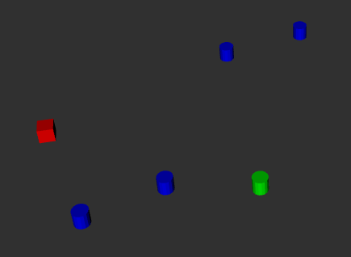
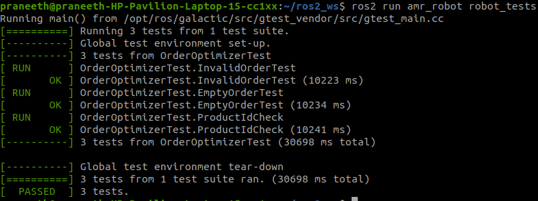

## Mobile Robot Order Optimizer:

## Steps to test:

* Clone the repository amr_example to your workspace.
* Buils the two packages inside the repository using:

            colcon build --packages-select custom_msg_amr amr_robot
* After the build, source the workspace.
* Launch the OrderOptimizer node using the following command:

        ros2 launch amr_robot robot_order.launch.py directory_path:{YOUR_DIRECTORY_PATH}

        For example:
        
        ros2 launch amr_robot robot_order.launch.py directory_path:="/home/praneeth ros2_ws/src/amr_example/amr_robot/config"
* Publish the nextOrder topic to get the shortest path for robot to reach the destination, using:

        ros2 topic pub --once /nextOrder custom_msg_amr/msg/Order "{order_id: 1000005, description: 'order'}"
    Change the order_id and description according to your requirement.

### Unit test cases execution:

* I wrote three unit tests for the above solution. You can run the unit tests using this command:

        ros2 run amr_robot robot_tests

### Example solutions:

* Terminal ouput for a given order:

* Marker arrays for the current position of robot (Red), pick-up points (Blue) and destination (Green) in RVIZ:

* Terminal ouput for test cases:

